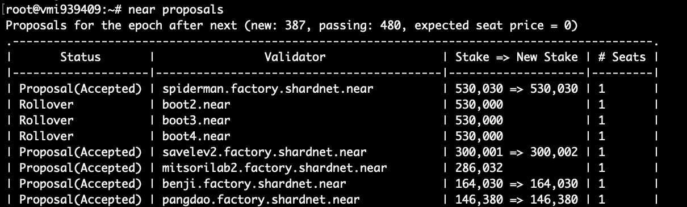

# Near Stake Wars 


## About The Project
[Homepage](https://near.org/stakewars/) | [Official Doc](https://github.com/near/stakewars-iii)

NEAR is a collective, a foundation, and a development platform built on a new layer-one blockchain.

Participate in Stake Wars III and join NEAR’s mission to bring ‘Chunk-Only Producers’ to Mainnet.  

Chunk-Only Producers are introduced by reaching Sharding Phase 1, and bring a more accessible role for those who may not have the $NEAR required to run a Block Producer node. This new role will allow the validator number to grow, creating more opportunities to earn rewards and secure the NEAR Ecosystem.

----------
## Summary 
- Status: 
    - [RUNNING] **[NEAR Stake Wars: Episode III Incentivized Testnet](https://near.org/stakewars/)**

- Rating: Guarantee
- Date Start: Jul 2022
- End Start: Sep 2022
- Rewards Distribution: 
    - Delegated NEAR Points (DNP): at the end of the Stake Wars program, each Delegated NEAR Point (DNP) will be translated into 500 NEAR tokens delegated to your mainnet account for 1 year.
    - Unlocked NEAR Points (UNP): at the end of the Stake Wars program, each Unlocked NEAR Point (UNP) will be translated into 1 unlocked NEAR token, granted to your mainnet account.


----------
## System Requirements 
- Linux distribution: Ubuntu is referred
- 4-Core CPU with AVX support
- 8 GB RAM
- 500 GB SSD

----------
## A. Preparation
1. Need a server to run. You can use either your local server or buy a VPS/VDS from some public cloud services:  
    [Contabo](https://contabo.com/en/vps/) | [Vultr](https://www.vultr.com/?ref=9092122) | [DigitalOcean](https://www.digitalocean.com/?refcode=6c9338218bd0) | [Hetzner](https://www.hetzner.com/cloud) | AWS | AZURE | CGP

    Note: I am using Ubuntu 20 in this guide so if you are using other OS, please find a alternative commands if needed.

2. After startup your server, then you need to use ssh potocol to access your server. If you don't know how to use ssh, you can refer to use Putty from [this tutorial](https://www.hostinger.com/tutorials/how-to-use-putty-ssh).  

----------
## B. STAKE WARS III challenges
There are 9 [challenges](https://github.com/near/stakewars-iii/blob/main/challenges/challenge-summary.md) at this time.  
This file contains an overview of the published and draft challenges for Stake Wars. We plan to release new challenges every few days, and this file will be constantly updated to include the new challenges tha are coming up.

| ID                                                                       | Status    | Publish date | Due date   | Owner     | Description                                                                       | Max points       | Type     | Target network |
| ------------------------------------------------------------------------ | --------- | ------------ | ---------- | --------- | --------------------------------------------------------------------------------- | ---------------- | -------- | -------------- |
| [001](https://github.com/near/stakewars-iii/blob/main/challenges/001.md) | Published | 2022-07-13   | 2022-08-11 | OSA       | Create your Shardnet wallet & deploy the NEAR CLI.                                | \-               | Core     | Shardnet       |
| [002](https://github.com/near/stakewars-iii/blob/main/challenges/002.md) | Published | 2022-07-13   | 2022-08-11 | OSA       | Deploying a node, download a snapshot, sync it, activate the node as a validator. | 30 UNP           | Core     | Shardnet       |
| [003](https://github.com/near/stakewars-iii/blob/main/challenges/003.md) | Published | 2022-07-13   | 2022-08-11 | OSA       | Deploy a new staking pool for your validator                                      | 10 UNP           | Core     | Shardnet       |
| [004](https://github.com/near/stakewars-iii/blob/main/challenges/004.md) | Published | 2022-07-13   | 2022-08-11 | OSA       | Setup tools for monitoring node status                                            | 15 UNP           | Core     | Shardnet       |
| [005](https://github.com/near/stakewars-iii/blob/main/challenges/005.md) | Published | 2022-07-15   | 2022-08-11 | Meta Pool | Setup a validator node on one of the most popular cloud providers.                | 10 DNP           | Optional | Shardnet       |
| [006](https://github.com/near/stakewars-iii/blob/main/challenges/006.md) | Published | 2022-07-19   | 2022-08-11 | Meta Pool | Cron task for ping                                                                | 5 UNP            | Core     | Shardnet       |
| 007                                                                      | Draft     | 2022-07-22   | 2022-09-07 | LiNEAR    | Data Science for Staking                                                          | 20 DNP           | Optional | Shardnet       |
| 008                                                                      | Draft     | 2022-07-26   | 2022-08-11 | Meta Pool | Split revenue for staking rewards                                                 | 30 DNP<br>50 UNP | Optional | Shardnet       |
| 009                                                                      | Draft     | 2022-07-29   | 2022-09-07 | LiNEAR    | Staking Farm 2.0                                                                  | 30 DNP<br>50 UNP | Optional | Shardnet       |

Summary for the point system:
* Delegated NEAR Points (DNP): at the end of the Stake Wars program, each Delegated NEAR Point (DNP) will be translated into 500 NEAR tokens delegated to your mainnet account for 1 year.
* Unlocked NEAR Points (UNP): at the end of the Stake Wars program, each Unlocked NEAR Point (UNP) will be translated into 1 unlocked NEAR token, granted to your mainnet account.

Form for Stakewars submissions - Will update when new challenge :): [Google Form](https://docs.google.com/forms/d/e/1FAIpQLScp9JEtpk1Fe2P9XMaS9Gl6kl9gcGVEp3A5vPdEgxkHx3ABjg/viewform)

We will go through these challenges together then submit the result.  

----------

### I. Challenge 001 
[Ogirinal Document](https://github.com/near/stakewars-iii/blob/main/challenges/001.md)  
Create your Shardnet wallet & deploy the NEAR CLI. This is designed to be your very first challenge: use it to understand how staking on NEAR works.  
As my experience, you can install Near CLI on the Node that you are planning to install the validator node.   

#### 1. Reward & Submission
- *Rewards: No reward but need to do to unlocked at the end of Challenge 002.*  
- *No submission si required for this challenge; it will be evaluated together with the next one (002).*

#### 2. Challenge Step By Step
- Create NEAR Wallet:  
Go to [https://wallet.shardnet.near.org/](https://wallet.shardnet.near.org/), click **Create Account** button, input the name of your account into Account ID text box.  
Then click **Reserve My Account ID** button, select **Secure Passphrase** and click Continue button. Now you need to backout the 12 seed words (passpharse).   
Now input word as request to verify the account.  
Finally, you will get your near account. We will need this account to use in challenge 002.  
For example in my case:  
Account ID: tonyxoac  
Wallet: tonyxoac.shardnet.near  
Seedphrase: WORD1-..-....-..-WORD12  

- Setup NEAR-CLI: We will use this near CLI to run command for staking, check validator node's status and so on.  
    ```sh
    # Update apt
    sudo apt update && sudo apt upgrade -y

    # Install Node.js and npm
    curl -sL https://deb.nodesource.com/setup_18.x | sudo -E bash -  
    sudo apt install build-essential nodejs
    PATH="$PATH"

    # Check version of node and npm to verify the installation
    node -v
    v18.6.0

    npm -v
    8.13.2

    # Install near-cli
    sudo npm install -g near-cli

    # The environment will need to be set to select the correct network.
    # For this chunk-only producer, we'll be using shardnet network
    echo 'export NEAR_ENV=shardnet' >> ~/.bashrc && source .bashrc
    ```
- Near CLI Commands.  
Full list of Near CLI commands: [https://github.com/near/near-cli](https://github.com/near/near-cli)  
Some useful commands: 

    ```sh
    # A proposal by a validator indicates they would like to enter the validator set, in order for a proposal to be accepted it must meet the minimum seat price.
    near proposals

    # This shows a list of active validators in the current epoch, the number of blocks produced, number of blocks expected, and online rate. Used to monitor if a validator is having issues.
    near validators current

    # This shows validators whose proposal was accepted one epoch ago, and that will enter the validator set in the next epoch.
    near validators next
    ```

**near proposal list**


**current near validators list**


**next near validators list**
  

----------

### II. Challenge 002 
[Ogirinal Document](https://github.com/near/stakewars-iii/blob/main/challenges/002.md)  
This challenge is focused on deploying a node (nearcore), downloading a snapshot, syncing it to the actual state of the network, then activating the node as a validator.   
System Requirements  
- Linux distribution: Ubuntu is referred
- 4-Core CPU with AVX support
- 8 GB RAM
- 500 GB SSD

#### 1. Reward & Submission
- *Rewards: 30 Unlocked NEAR Points (UNP)*  

#### 2. Challenge Step By Step
- Install dependencies:  
    ```sh
    # Check system compatibility that CPU supports AVX
    lscpu | grep -P '(?=.*avx )(?=.*sse4.2 )(?=.*cx16 )(?=.*popcnt )' > /dev/null \
    && echo "Supported" || echo "Not supported"
    Supported

    # Install Dependencies 
    sudo apt install -y git binutils-dev libcurl4-openssl-dev zlib1g-dev libdw-dev libiberty-dev cmake gcc g++ python3 docker.io protobuf-compiler libssl-dev pkg-config clang llvm cargo

    # Install Python pip
    sudo apt install python3-pip

    # Include base bin path
    USER_BASE_BIN=$(python3 -m site --user-base)/bin
    export PATH="$USER_BASE_BIN:$PATH"

    # Install build tools
    sudo apt install clang build-essential make

    # Install Rust
    curl --proto '=https' --tlsv1.2 -sSf https://sh.rustup.rs | sh
    source $HOME/.cargo/env
    ```

- Build and install nearcore binary:  
    ```sh
    cd ~/
    # Clone nearcore repo
    git clone https://github.com/near/nearcore
    cd ~/nearcore
    git fetch origin --tags
    # checkout runable commit
    git checkout -b 0f81dca95a55f975b6e54fe6f311a71792e21698

    # Build the binary, this will take some time
    cargo build -p neard --release --features shardnet

    # Check version of nearcore
    ./target/release/neard -V
    neard (release trunk) (build crates-0.14.0-218-g8448ad1eb) (rustc 1.62.0) (protocol 100) (db 31)
    ```

- Start node:  
    ```sh
    cd ~/nearcore
    ./target/release/neard --home ~/.near init --chain-id shardnet --download-genesis

    # Remove old config file
    rm ~/.near/config.json
    # Download and re-configure file
    wget -O ~/.near/config.json https://s3-us-west-1.amazonaws.com/build.nearprotocol.com/nearcore-deploy/shardnet/config.json
    sed -e 's/"archive": false/"archive": true/' -i ~/.near/config.json

    # Config systemctl to manage node process
    # Create /etc/systemd/system/neard.service file with content below:
    sudo vi /etc/systemd/system/neard.service

    # START neard.service file's content
    [Unit]
    Description=neard
    After=network-online.target

    [Service]
    Type=simple
    User=root
    WorkingDirectory=/root/.near
    ExecStart=/root/nearcore/target/release/neard run   
    Restart=on-failure
    RestartSec=30
    KillSignal=SIGINT
    TimeoutStopSec=45
    KillMode=mixed

    [Install]
    WantedBy=multi-user.target
    # END neard.service file's content

    # Enable daemon and start service
    sudo systemctl enable neard.service
    # Start node
    sudo systemctl start neard
    # After start node, you need to wait for a time to sync your node.

    # For pretty log printing, install ccze
    sudo apt install ccze -y

    # run this command to monitor log
    journalctl -n 100 -f -u neard | ccze -A
    ```
**check near node log**


- Activating the node as validator:  
    Login to near account
    ```sh
    near login
    ```
    
    Copy the URL that is shown on the console and access to that URL, then do following the instruction on web.
    
    
    
    
    When you finish on web, go back to the terminal console and then enter your wallet.

- Configure validator_key.json
    ```sh
    cp ~/.near-credentials/shardnet/<YOUR_WALLET_NAME>.shardnet.near.json ~/.near/validator_key.json

    # Edit account_id and private_key of ~/.near/validator_key.json
    vi $HOME/.near/validator_key.json

    # Change from
    {
    "account_id":"tonyxoacsw.shardnet.near",
    "public_key":"ed25519:8T2JAfFxfUMFNbSxNySH35B5zb5ZEYEeyb55B74eC9Pj",
    "private_key":"ed25519:XXXXXXXXXXXXXXXXXXXXXXXXXXXXXXXXXXXXXXXXXXXXXXXXXXXXXX"
    }
    # to this
    {
    "account_id":"tonyxoacsw.factory.shardnet.near",
    "public_key":"ed25519:8T2JAfFxfUMFNbSxNySH35B5zb5ZEYEeyb55B74eC9Pj",
    "secret_key":"ed25519:XXXXXXXXXXXXXXXXXXXXXXXXXXXXXXXXXXXXXXXXXXXXXXXXXXXXXX"
    }
    
    ```  

----------

### II. Challenge 003 
[Ogirinal Document](https://github.com/near/stakewars-iii/blob/main/challenges/003.md)  
Deploy a new staking pool for your validator. Do operations on your staking pool to delegate and stake NEAR.   

#### 1. Reward & Submission
- *Rewards: 10 Unlocked NEAR Points (UNP).*  

#### 2. Challenge Step By Step
For better clarity, we’ll provide examples for these parameters:  
<pool_name>: tonyxoacsw  
<account_id>: tonyxoacsw.shardnet.near  
<pool_id>: tonyxoacsw.factory.shardnet.near  
<public_key> 8T2JAfFxfUMFNbSxNySH35B5zb5ZEYEeyb55B74eC9Pj

- Deploy a Staking Pool Contract:  
    ```sh
    # Replace pool_id, account_id and public_key following yours
    near call factory.shardnet.near create_staking_pool '{"staking_pool_id": "<pool_id>", "owner_id": "<account_id>", "stake_public_key": "<public_key>", "reward_fee_fraction": {"numerator": 5, "denominator": 100}, "code_hash":"DD428g9eqLL8fWUxv8QSpVFzyHi1Qd16P8ephYCTmMSZ"}' --accountId="<account_id>" --amount=30 --gas=300000000000000
    ```
    You should receive an URL similar to this after run command:
    

- Check your node on explorer:  
    Go to https://explorer.shardnet.near.org/nodes/validators and find your node: 
    

- View staked balance:  
    ```sh
    near view tonyxoacsw.factory.shardnet.near get_account_staked_balance '{"account_id": "tonyxoacsw.shardnet.near"}'
    ```
- Ping:  
    A ping issues a new proposal and updates the staking balances for your delegators. A ping should be issued each epoch to keep reported rewards current
    ```sh
    near call <pool_id> ping '{}' --accountId <account_id> --gas=300000000000000
    ```  

----------

### IV. Challenge 004 
[Ogirinal Document](https://github.com/near/stakewars-iii/blob/main/challenges/004.md)  

Setup tools for monitoring node status. Install and use RPC on port 3030 to get useful information for keep your node working.

#### 1. Reward & Submission
- *Rewards: 15 Unlocked NEAR Points (UNP)*

#### 2. Challenge Step By Step
- Setup NEAR-CLI: We will use this near CLI to run command for staking, check validator node's status and so on.  
    ```sh
    # Check your node version
    curl -s http://127.0.0.1:3030/status | jq .version

    # Check delegators and stake 
    near view tonyxoacsw.factory.shardnet.near get_accounts '{"from_index": 0, "limit": 10}' --accountId tonyxoacsw.shardnet.near

    # Check reason for validator kicked
    curl -s -d '{"jsonrpc": "2.0", "method": "validators", "id": "dontcare", "params": [null]}' -H 'Content-Type: application/json' https://rpc.shardnet.near.org/ | jq -c '.result.prev_epoch_kickout[] | select(.account_id | contains ("tonyxoacsw"))' | jq .reason

    # Check blocks produced / expected 
    curl -s -d '{"jsonrpc": "2.0", "method": "validators", "id": "dontcare", "params": [null]}' -H 'Content-Type: application/json' http://localhost:3030/ | jq -c '.result.current_validators[] | select(.account_id | contains ("tonyxoacsw.factory.shardnet.near"))'
    ```
    **Check delegators and stake**
      

----------

### V. Challenge 005 
[Ogirinal Document](https://github.com/near/stakewars-iii/blob/main/challenges/005.md)  
Setup a running validator node for shardnet on any one of the most popular cloud providers and document the process to create an article about it.  
- Amazon Web Services (AWS)
- Google Cloud Platform
- Microsoft Azure
- IBM Cloud
- DigitalOcean
- Hetzner  

#### 1. Reward & Submission
- *Rewards: 10 Delegated NEAR Points (DNP).* 
- Submission: After you finished the challenge, go to this form and submit: [Google Form](https://docs.google.com/forms/d/e/1FAIpQLScp9JEtpk1Fe2P9XMaS9Gl6kl9gcGVEp3A5vPdEgxkHx3ABjg/viewform)  

#### 2. Challenge Step By Step
Firstly, you need go to https://portal.aws.amazon.com/billing/signup#/start/email and create your AWS account.  
After your AWS account is acctivated, go to [https://us-east-1.console.aws.amazon.com/ec2/v2/home?region=us-east-1#Instances:](https://us-east-1.console.aws.amazon.com/ec2/v2/home?region=us-east-1#Instances:), click on launch instance and select some option of AWS instance, then launch a EC2 instance.

After your instance ready, then following the tutorial from [https://nodes.migoi.io/en/latest/near-stake-wars.html#id1](https://nodes.migoi.io/en/latest/near-stake-wars.html#id1) to install your node on AWS.

- EC2 Instance System Requirements  
  - Linux distribution: Ubuntu v20.x is referred
  - 4-Core CPU with AVX support
  - 8 GB RAM
  - 500 GB SSD (General Purpose SSD - Storage $0.08/GB-month)

- Pricing: ~125$ (EC2 c5.xlarge type) + 40$ (500GB SSD) = **165$ Monthly**
  

----------

### VI. Challenge 006 
[Ogirinal Document](https://github.com/near/stakewars-iii/blob/main/challenges/006.md)  
Create a cron task on the machine running node validator that allows ping to network automatically.  

#### 1. Reward & Submission
- *Rewards: 5 Unlocked NEAR Points (UNP)* 
- Submission: After you finished the challenge, go to this form and submit: [Google Form](https://docs.google.com/forms/d/e/1FAIpQLScp9JEtpk1Fe2P9XMaS9Gl6kl9gcGVEp3A5vPdEgxkHx3ABjg/viewform)  

#### 2. Challenge Step By Step
- Create a cron job to run ping every epoch:
    ```sh
    crontab -e 
    # A ping issues a new proposal and updates the staking balances for your delegators. A ping should be issued each epoch to keep reported rewards current.
    # Change to pool_id and account_id following yours
    POOL_ID=tonyxoacsw.factory.shardnet.near  
    ACCOUNT_ID=tonyxoacsw.shardnet.near  
    NEAR_ENV=shardnet  
    # running every 15 minutes:
    */15 * * * * near call $POOL_ID ping '{}' --accountId $ACCOUNT_ID --gas=300000000000000 >> $HOME/cron.log
    ```  

----------

### VII. Challenge 007 (TBD)
[Ogirinal Document](https://github.com/near/stakewars-iii/blob/main/challenges/007.md)  
Blockchain is big data. We believe that very interesting data insights could be found out through investigating staking data on NEAR. Please try to find out some valuable data from staking and validators and build a visualized data dashboard for everyone to access.

#### 1. Reward & Submission
- *Rewards: 20 Delegated NEAR Points (DNP).* 
- Submission: After you finished the challenge, go to this form and submit: [Google Form](https://docs.google.com/forms/d/e/1FAIpQLScp9JEtpk1Fe2P9XMaS9Gl6kl9gcGVEp3A5vPdEgxkHx3ABjg/viewform)  

#### 2. Challenge Step By Step  

----------

### VIII. Challenge 008  (TBD)
[Ogirinal Document](https://github.com/near/stakewars-iii/blob/main/challenges/008.md)  

#### 1. Reward & Submission
- *Rewards: 80 Delegated NEAR Points (DNP).* 
- Submission: After you finished the challenge, go to this form and submit: [Google Form](https://docs.google.com/forms/d/e/1FAIpQLScp9JEtpk1Fe2P9XMaS9Gl6kl9gcGVEp3A5vPdEgxkHx3ABjg/viewform)  

#### 2. Challenge Step By Step  

----------

### IX. Challenge 009  (TBD)
[Ogirinal Document](https://github.com/near/stakewars-iii/blob/main/challenges/009.md)   
Aurora launched the first staking farm on NEAR early this year and there’s a lot of fun. However there are still some unresolved problems associated with it, such as how to make the APY sustainable, how to make staking farm more decentralized and how one user could earn multiple staking farm rewards at the same time, etc. Please propose an improved staking farm solution which could help to solve some of these challenges.  

#### 1. Reward & Submission
- *Rewards: 80 Delegated NEAR Points (DNP).* 
- Submission: After you finished the challenge, go to this form and submit: [Google Form](https://docs.google.com/forms/d/e/1FAIpQLScp9JEtpk1Fe2P9XMaS9Gl6kl9gcGVEp3A5vPdEgxkHx3ABjg/viewform)  

#### 2. Challenge Step By Step
